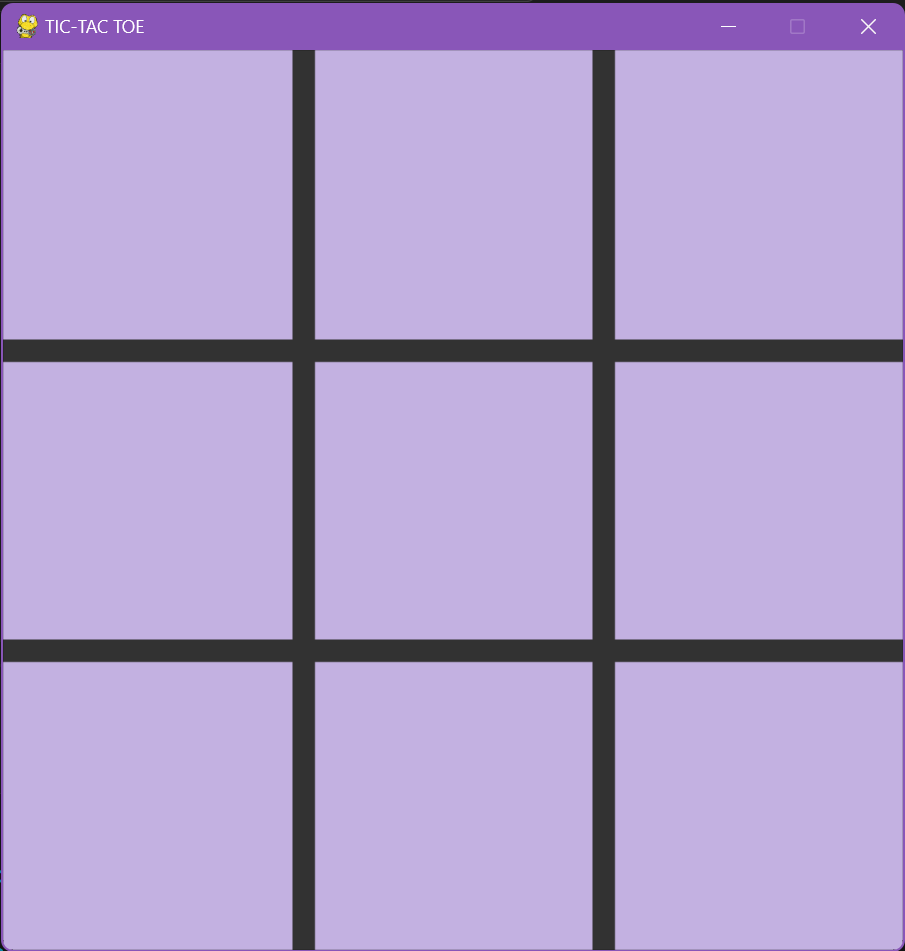
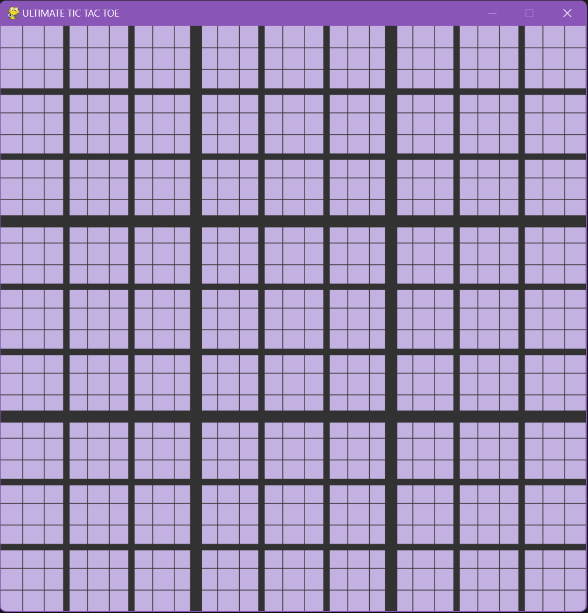

# Unbeatable Minimax AI for TicTacToe Game

A modified classic version of the game which has 81 and 729 squares respectively. Version 1: [TicTacThinker Game](https://github.com/techgirldiaries/TicTacThinker)

## Features
- added two more game modes, ultimate and max.  
- has 81 and 729 squares respectively.
- used the minimax algorithm method as the game theory.

## Game Instructions
- Entry point: main.py
- Change game mode on main.py line 12 (classic, ultimate, max)
- Press 'r' to restart the game

## Game Snapshots

### Snapshot 1 - Classic Game Mode

### Snapshot 2 - Ultimate Game Mode

### Snapshot 3 - Max Game Mode

### Snapshot 4 - Max Board

### Snapshot 5 - Ultimate Win

